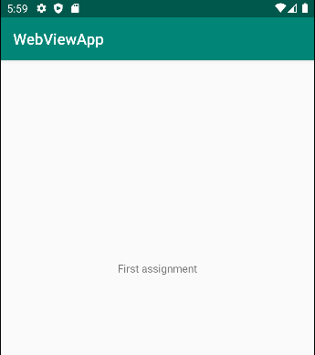

# Rapport

Uppdaterade texten i textfältet i [main_content.xml](https://github.com/a21oligu/mobileapp-programming-hello/blob/master/app/src/main/res/layout/content_main.xml) från 
  _Hello World!_ till _First assignment_ enligt kodblocket nedan:

`android:text="First assignment"`

